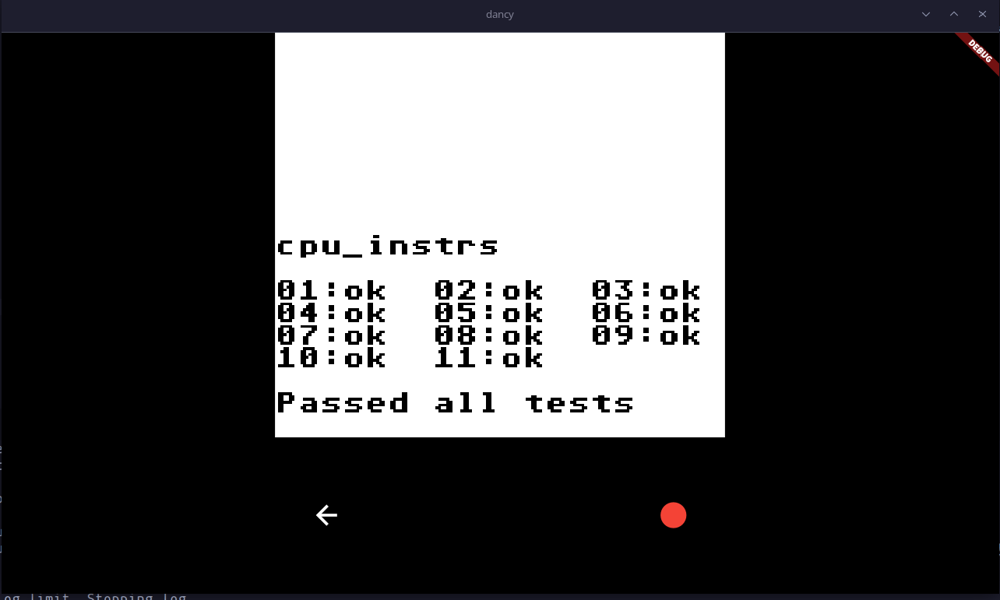
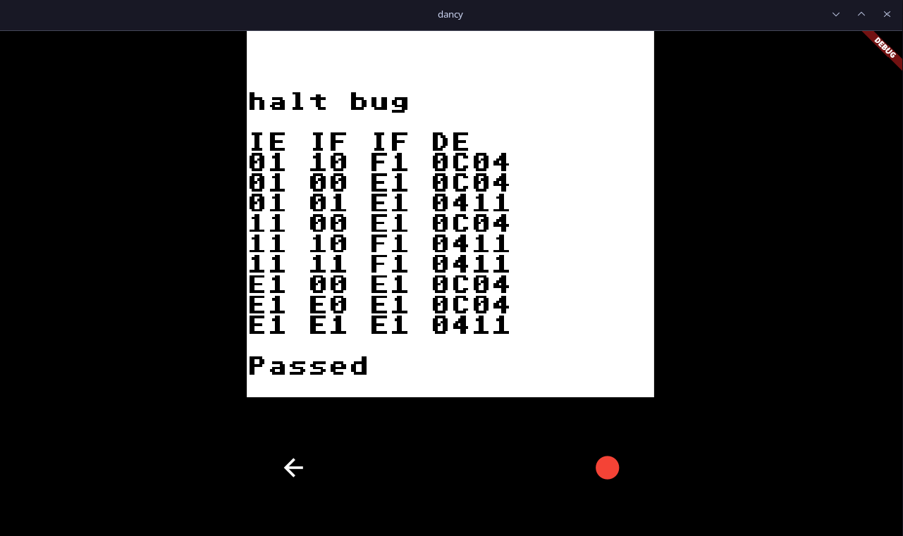
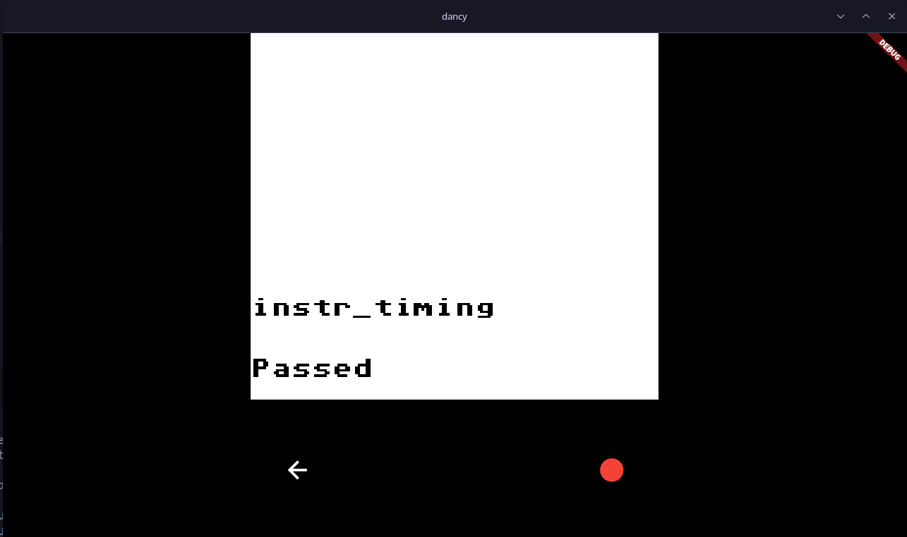

# The Dancy Mandarin Game
This is a Game Boy emulator written in Rust and Flutter that aims to be cycle-accurate and have a nice looking native UI. Made purely for learning Rust and CPU architecture. The name could be the biggest innovation in this project yet.

### Current state:

